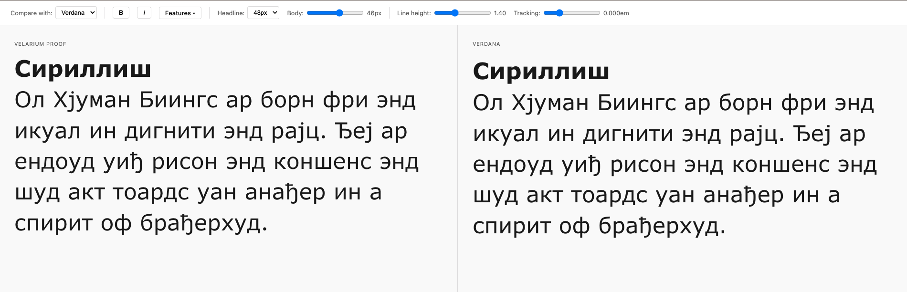
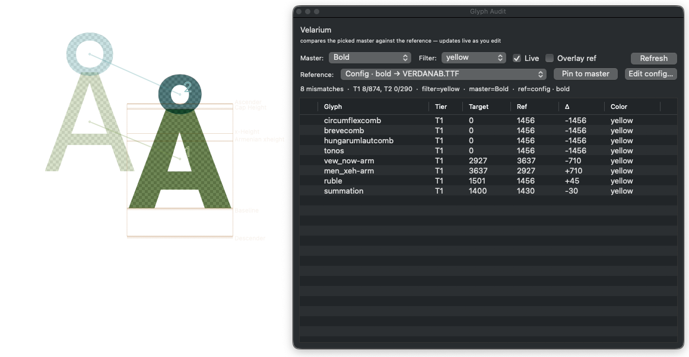

# GlyphAudit — DocRepair Tools

Part of the **DocRepair tools** for the Google Fonts docrepair project: building metrics-compatible replacement fonts that can stand in for an original document face without reflowing the documents that used it. The whole toolkit exists to answer one question fast, per glyph, per master: *does this typeset like the reference?*

Tiered audit of a target font against one or more references — by codepoint, OpenType feature variant, and unencoded internals. Designed for type designers working in Glyphs who need to **match-but-not-quite** an original: same advances and coverage, distinct outlines.

Ships two complementary surfaces:

- **`glyph-audit proof serve`** — a browser-based side-by-side proof view that renders your working font next to configured reference families. Watches your source for changes and hot-rebuilds.

  

- **Glyphs.app panels** — installed as one **Script → DocRepair Tools** submenu with two entries: **Glyph Audit** (live advance-width mismatch table with per-master reference pins, plus an edit-view overlay drawing the reference outline, its nodes, and metric-delta bands behind your glyph) and **Make Proof** (colour-filtered proof compiler + launcher for the web view).

  

Both are installed by `pip install docrepair-glyph-audit[proof]`; the submenu then installs via `glyph-audit proof panel install`.

## Install

From PyPI:

```bash
pip install docrepair-glyph-audit               # core (CLI only)
pip install "docrepair-glyph-audit[glyphs]"     # + Glyphs source support
pip install "docrepair-glyph-audit[proof]"      # + `glyph-audit proof serve` extras
pip install "docrepair-glyph-audit[ai]"         # + Claude / OpenAI / Gemini AI summaries
pip install "docrepair-glyph-audit[all]"        # everything

# Note: the console script + Python module are still `glyph-audit` /
# `GlyphAudit` — only the PyPI distribution name is namespaced.
```

Or from a checkout (editable):

```bash
pip install -e ".[glyphs]"
```

The `glyph-audit` console command is now on your `$PATH` (equivalent to `python -m GlyphAudit`).

## Quickstart

```bash
glyph-audit --target sources/MyTypeface.glyphspackage \
            --pair Regular=Reference-Regular.ttf \
            --pair Bold=Reference-Bold.ttf
```

Writes `glyph-audit-report.md` next to wherever you ran it.

On first run with no `--pair` and no config, the tool bootstraps `~/.glyph-audit/config.toml` from the bundled template and prints next steps.

## Configure once

Set up `~/.glyph-audit/config.toml` so daily runs are one flag:

```toml
[defaults]
filter      = "ready"
from_config = true
output      = "glyph-audit-report.md"

[instances.Regular]
ref = "/path/to/Reference-Regular.ttf"

[instances.Bold]
ref = "/path/to/Reference-Bold.ttf"
```

Then:

```bash
glyph-audit --target sources/MyTypeface.glyphspackage
```

References can be static TTF/OTF, variable fonts (with axis pinning), system-installed fonts, Glyphs sources, or Google Fonts. Full schema and examples → [docs/configuration.md](docs/configuration.md).

### Make it even shorter

Once the config is in place, wrap it in your build system or shell. A `Makefile` recipe pairs nicely with the rest of a typeface project:

```make
TARGET ?= sources/MyTypeface.glyphspackage
audit:
	-glyph-audit --target "$(TARGET)"
```

```bash
make audit                                                # default target
make audit TARGET=sources/MyTypeface-working.glyphspackage # the working file
```

The leading `-` lets `make` ignore `glyph-audit`'s non-zero exit when mismatches are found — that's the audit's normal "I found something" signal, not a build failure.

### Multiple typefaces?

The defaults above live in `~/.glyph-audit/config.toml` so they apply to every project on your machine. If you work on more than one typeface, drop a per-project config alongside the source and point at it explicitly:

```bash
glyph-audit --target sources/MyTypeface.glyphspackage --config .glyph-audit.toml
```

`.glyph-audit.toml` accepts the same `[defaults]` and `[instances.*]` sections. See [docs/configuration.md#project-local-config](docs/configuration.md#project-local-config) for the gotchas (notably: don't commit it if it holds API keys).

## What the report shows

Three tiers per target/reference pair:

- **Tier 1** — every encoded glyph, paired by Unicode codepoint.
- **Tier 2** — every variant glyph (`a.smcp`, `I.ss01`, …) paired by `(codepoint, feature)`.
- **Tier 3** — internal helpers (components, ligature parts), listed for completeness.

Mismatches are sorted by severity. With `--ai claude` (or `openai` / `gemini`), an AI-written summary is prepended to the top calling out anomalies in plain English.

More detail → [docs/concepts.md](docs/concepts.md).

## Preview — side-by-side proof viewer

A React+Vite app at [`preview/`](preview/) renders your work-in-progress font next to a reference in two synced editable panels. Type in the left (proof) panel; the right mirrors verbatim against whichever reference font you bundle, so identical advance widths produce identical line wraps — the moment they diverge, you can see exactly where.

It reads the same `[instances.*]` block in `~/.glyph-audit/config.toml` that the CLI uses, so once the audit is set up the preview needs no extra config:

```bash
# Build the proof font + manifests from your source:
python preview/build.py --source sources/MyTypeface.glyphspackage

# Start the dev server (in another terminal):
cd preview && npm install && npm run dev
```

The build script writes `preview/public/{proof-font.ttf, proof-config.json, available-{chars,features}.json}`; the React app polls those every 3 s, so a re-build (or `build.py --watch`) hot-reloads the panels without manual refresh. Setup, CLI reference, and licensing notes → [preview/README.md](preview/README.md).

## Live audit panel inside Glyphs.app

For a floating Vanilla window that shows width mismatches in real time while you edit, symlink [`examples/glyphs/width_audit_panel.py`](examples/glyphs/width_audit_panel.py) into Glyphs's user-scripts folder:

```bash
ln -sf "$(pwd)/examples/glyphs/width_audit_panel.py" \
    "$HOME/Library/Application Support/Glyphs 3/Scripts/Width Audit Panel.py"
```

Then in Glyphs: hold Option + click the Script menu → Reload Scripts, and the panel appears under **Script → Width Audit Panel**. It reuses the same `[instances.*]` references from `~/.glyph-audit/config.toml` that the CLI does — no extra setup. Run the menu item again to toggle it off. Details → [examples/glyphs/README.md](examples/glyphs/README.md).

## Documentation

- [docs/cli.md](docs/cli.md) — full flag reference, exit codes, and recipes
- [docs/configuration.md](docs/configuration.md) — config file schema, all five reference forms (static, VF, system, Glyphs source, Google Fonts)
- [docs/concepts.md](docs/concepts.md) — what each tier covers, how rows are tagged, how to read the report
- [docs/ai-summary.md](docs/ai-summary.md) — `--ai` setup, custom prompts, privacy notes
- [preview/README.md](preview/README.md) — side-by-side proof viewer (React/Vite app) setup, CLI, and architecture
- [examples/glyphs/README.md](examples/glyphs/README.md) — Glyphs.app live-audit panel setup and usage

## Limitations

- Tier 2 matches `SingleSubst` GSUB lookups only — `MultipleSubst` / `LigatureSubst` / contextual lookups don't pair on the reference side.
- Sidebearings (LSB / RSB), kerning, anchors, and outline shapes are not compared. Only advance widths.
- `--ai` sends a summary of mismatch data (glyph names, codepoints, widths — no outlines) to the chosen LLM provider. Don't enable it on confidential work.

## Licence

MIT — see [LICENSE](LICENSE).
